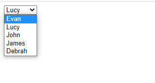
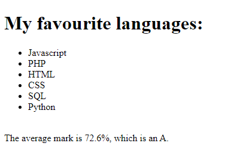

# HyperionDev Full Stack Web Development Bootcamp - Level 1 - Task 11 - Arrays

## Description
This task uses Arrays in Javascript to store fictitious marks for students and then create elements such as lists and dropdown menus from the data in the array with loops. It was also some of my first experience with writing to the DOM (Document Object Model) using Javascript.

## Table of Contents
* [Instructions](#instructions)
* [Technologies](#technologies)
* [Installation](#installation)
* [Usage](#usage)
* [Credits](#credits) 

## Instructions
There are 2 parts to this task. These were the instructions I was given to guide me:

**Compulsory Task 1**
Follow these steps:
* Create a .js file called arrayTask.js and open arrayTask.html. Feel free to modify arrayTask.html as needed for this task.
* In arrayTask.js write the code needed to do the following (use functions):
    * Create an array called ‘favLanguages’ that includes at least 5 programming languages that you would like to learn. Use a loop to display each programming language in ‘favLanguages’ on arrayTask.html in the list element: <ul id="favLanguages">.
    * Create an array called ‘myJSTestResults’ that stores a list of results out of 100 that you have scored for 5 fictitious tests that you have written in a fictitious JavaScript class. E.g. let myJSTestResults = [40, 60, 80, 80, 85];
    * Write the code that will calculate the average grade based on the results in my ‘myJSTestResults’. For example, the average grade based on the values in the example above would be: let average = (40 + 60 + 80 + 80 + 85)/5; Based on the average grade, decide which letter symbol should be assigned. Use the table below:
        Average percentage Letter symbol
        80 - 100 A
        70 - 79 B
        60 - 69 C
        50 - 59 D
        49 or less F
* Output your results to the div element with the id "myGrades" in arrayTask.html.

**Compulsory Task 2**
Follow these steps:
* Create a .js file called task2.js and a file called task2.html. Write the code necessary to do the following:
    * Use a map to store the names of 5 students with their corresponding average grade. You can initialise this map with fictitious hardcoded names and grades.
    * Write the JavaScript to display the name of each student in a drop-down menu. When the student’s name is selected from the drop-down menu, the student’s grade should be displayed using an alert. (Hint: Remember that you can use the value and innerHTML attributes of an <option> element.)

### Technologies
This project uses:
* HTML 5 
* CSS 3
* Javascript ECMAScript 2021

## Installation
This project was created using html and Javascript, so it needs no special installation. Simply open the html files for each of the 2 tasks in your browser and enjoy.

## Usage 
**Task 1**
Click on dropdown list and choose a name. You will then see an alert box pop up with that student's test mark. See figure 1 below.

**Task 2**
For this task, you will see a list of the programming languages stored in the array and the calculated average mark for the fictitious set of student test results. See figure 2 below.

## Credits
This project was created by Evan Malherbe as part of a task for HyperioDev Full Stack Development Bootcamp November 2021 [GitHub profile](https://github.com/evanmalherbe) 

